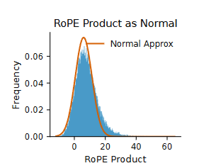
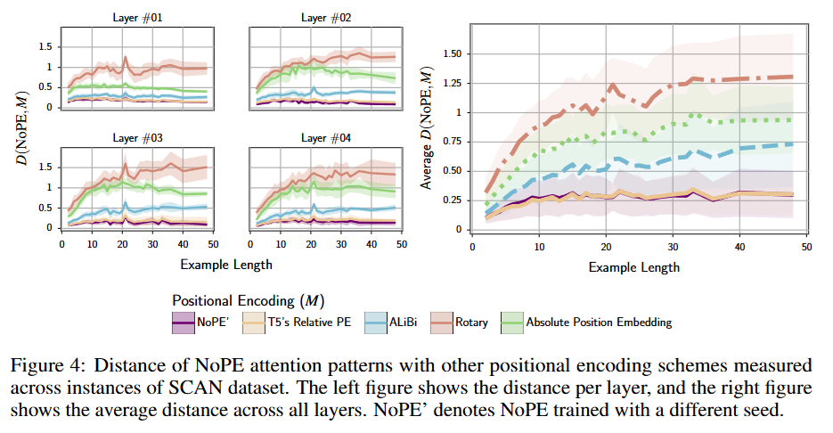
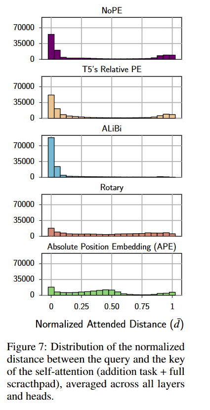

# 从 RoPE 到 NoPE：长上下文中的位置建模正在重新分工

当上下文长度从几千个 token 扩展到几十万，甚至更长时，语言模型遇到的瓶颈不只是显存和计算量,还有一个更基础的问题：**模型究竟应该如何理解“位置”？**

在 Transformer 中，注意力机制本身并不知道两个 token 的先后顺序。为了让模型区分“我爱你”和“你爱我”，研究者引入了各种位置编码，RoPE之前主要的研究可以大致区分成两类：绝对位置编码和相对位置编码。而 RoPE 凭借简洁、有效以及能融合相对位置编码和绝对位置编码的自然建模，成为大语言模型中的主流方案。

RoPE 的做法很优雅：根据 token 所处的位置，对 query 和 key 进行不同角度的旋转。这样一来，两个 token 的注意力分数就会显式依赖它们之间的相对距离。在训练长度以内，这种位置先验通常表现得非常好。

问题出现在更长的上下文中。

当模型被要求处理远超训练窗口的文本时，它面对的是训练阶段没有见过的旋转角度、频率组合和注意力模式。为了延长上下文，研究者不得不引入位置插值、频率缩放、YaRN 或其他复杂的外推方法。即使上下文窗口在形式上被扩展，模型对远距离信息的检索能力仍然可能下降。

这时，一个看似激进的想法重新进入了研究视野：

> **如果直接不显式注入位置编码，会发生什么？**

这就是 NoPE 的出发点。NoPE 不再直接向注意力分数中加入旋转位置，而是让模型通过 causal mask 和注意力长短窗口，自己学习隐式的位置关系。令人意外的是，在一些长度泛化任务中，没有显式位置编码的模型反而能够处理更长的序列。

但 NoPE 也不是一个简单的替代方案。它可能带来困惑度上升、短文本任务退化，以及有限的泛化长度。RoPE 和 NoPE 似乎分别擅长不同的事情：RoPE 提供稳定的短距离位置信息，而 NoPE 更有利于长距离位置理解。

于是，研究问题开始发生变化，进一步追问：**不同层、不同维度和不同注意力范围，是否应该使用不同的位置机制？**

这也引出了近年来逐渐出现的混合方案：让部分层继续使用 RoPE，部分层采用 NoPE；让 RoPE 层负责局部和近期信息，让 NoPE 层负责全局检索；甚至只在部分 attention head 或部分维度中保留旋转位置编码。

本文将从 RoPE 的工作原理和长上下文局限出发，介绍 NoPE 如何学习隐式位置关系，并进一步讨论 RoPE 与 NoPE 的混合设计，尝试回答一个更根本的问题：

> **长上下文模型需要的，究竟是一套统一的位置编码，还是一种分层的位置分工？**

## 1. RoPE：用绝对形式表达相对位置的优雅设计

非常推荐阅读苏剑林苏神的博客：
- [让研究人员绞尽脑汁的Transformer位置编码](https://spaces.ac.cn/archives/8130) 这篇介绍了早期的绝对和相对位置编码，以及早期关于 RoPE 想法的出现，读完之后真的会由衷赞叹苏神的想法，简直是太美妙了。
- [Transformer升级之路：2、博采众长的旋转式位置编码](https://spaces.ac.cn/archives/8265) 这篇比较详细介绍了 RoPE 的原理。
- 以及 RoPE 的论文：
[RoFormer: Enhanced Transformer with Rotary Position Embedding](https://arxiv.org/abs/2104.09864)

简单说，RoPE 的核心思想是：**让 query 和 key 在旋转角度上不同，从而让注意力分数显式依赖相对位置。**

### 1.1 从二维旋转开始

先把 query 或 key 的两个相邻维度看成一个二维向量。对于位置 $m$，RoPE 用旋转矩阵将它旋转 $m\theta$：

$$
\bm{R}(m\theta)=
\begin{bmatrix}
\cos(m\theta) & -\sin(m\theta)\\
\sin(m\theta) & \cos(m\theta)
\end{bmatrix}.
$$

因此，位于位置 $m$ 的 query 和位置 $n$ 的 key 分别变为

$$
\tilde{\bm{q}}_m=\bm{R}(m\theta)\bm{q}_m,\qquad
\tilde{\bm{k}}_n=\bm{R}(n\theta)\bm{k}_n.
$$

这里的 $\bm{q}_m,\bm{k}_n$ 是内容向量，旋转角度则携带了它们各自的绝对位置信息。

### 1.2 为什么最终表示的是相对位置

注意力分数由 query 和 key 的内积决定。加入 RoPE 后，有

$$
\begin{aligned}
\tilde{\bm{q}}_m^{\mathsf T}\tilde{\bm{k}}_n
&=(\bm{R}(m\theta)\bm{q}_m)^{\mathsf T}(\bm{R}(n\theta)\bm{k}_n)\\
&=\bm{q}_m^{\mathsf T}\bm{R}(m\theta)^{\mathsf T}\bm{R}(n\theta)\bm{k}_n\\
&=\bm{q}_m^{\mathsf T}\bm{R}((n-m)\theta)\bm{k}_n.
\end{aligned}
$$

其中用到了旋转矩阵的两个性质：

$$
\bm{R}(\alpha)^{\mathsf T}=\bm{R}(-\alpha),\qquad
\bm{R}(\alpha)\bm{R}(\beta)=\bm{R}(\alpha+\beta).
$$

可以看到，最终的注意力分数不再分别依赖 $m$ 和 $n$，而只依赖两者的相对距离 $n-m$。这正是 RoPE 巧妙之处：**用绝对位置对应的旋转，得到只依赖相对位置的内积。**

继续把上面的式子展开。

记 $\bm{k}_n^\perp$ 为 $\bm{k}_n$ 逆时针旋转 $90^\circ$ 后的向量（即 $(-k_2,k_1)$），利用 

$$
\begin{aligned}
\bm{R}(\Delta)\bm{k}
&=\begin{bmatrix}
\cos(m\theta) & -\sin(m\theta)\\
\sin(m\theta) & \cos(m\theta)
\end{bmatrix}\begin{bmatrix} k_1\\k_2\end{bmatrix}\\
&=\begin{bmatrix}k_1\cos\Delta-k_2\sin\Delta\\k_1\sin\Delta+k_2\cos\Delta\end{bmatrix}\\
&=\begin{bmatrix} k_1 \\ k_2 \end{bmatrix}\cos\Delta + \begin{bmatrix} -k_2\\k_1\end{bmatrix}\sin\Delta\\
&= \bm{k}\cos\Delta+\bm{k}^\perp\sin\Delta
\end{aligned},
$$

可以得到

$$
\begin{aligned}
\langle \tilde{\bm{q}}_m,\tilde{\bm{k}}_n\rangle
&=\bm{q}_m^{\mathsf T}\bm{R}((n-m)\theta)\bm{k}_n\\
&=\bm{q}_m^{\mathsf T}\left (\bm{k}_n\cos((n-m)\theta)+\bm{k}_n^\perp\sin((n-m)\theta)\right )\\
&=\underbrace{\langle \bm{q}_m,\bm{k}_n\rangle}_{\text{内容相似度}}\cos\bigl((n-m)\theta\bigr)
+\underbrace{\langle \bm{q}_m,\bm{k}_n^\perp\rangle}_{\text{正交分量}}\sin\bigl((n-m)\theta\bigr).
\end{aligned}
$$

这样就一目了然：

- 当 $m=n$ 时， $\cos 0=1, \sin 0=0$ ，分数退化为纯内容相似度，位置不干扰内容匹配；
- 距离拉开时， $\cos$ 项给内容相似度乘上一个随距离起伏的权重，$\sin$ 项掺入一个与内容正交的分量；
- 所以 RoPE 没有把位置加到分数上，而是**用相对距离去调制内容匹配的结果**——位置是乘性门控，不是加性偏置。

### 1.3 扩展到高维向量

实际模型中的 head dimension 通常为偶数 $d$。RoPE 将向量按两维一组，给第 $i$ 组使用不同频率

$$
\theta_i=10000^{-2i/d},\qquad i=0,1,\ldots,\frac d2-1.
$$

整体旋转矩阵是一个分块对角矩阵：

$$
\bm{R}_m=\mathrm{diag}\bigl(
\bm{R}(m\theta_0),\bm{R}(m\theta_1),\ldots,\bm{R}(m\theta_{\frac{d}{2}-1})
\bigr).
$$

于是标准缩放点积注意力写成

$$
s(m,n)
=\frac{(\bm{R}_m\bm{q}_m)^{\mathsf T}(\bm{R}_n\bm{k}_n)}{\sqrt d}
=\frac{\bm{q}_m^{\mathsf T}\bm{R}_{n-m}\bm{k}_n}{\sqrt d}.
$$

随后加上因果掩码（不可见位置置 $-\infty$），再经 softmax 得到注意力权重 $\alpha(m,n)=\mathrm{softmax}_n\,s(m,n)$。

### 1.4 直观理解

**（a）复数视角：位置就是相位**

把每两个维度看成复平面上的一根指针 $z=x_1+\mathrm{i}x_2$。乘以 $e^{\mathrm{i}m\theta}$ 就是把指针逆时针转动 $m\theta$：

$$
z^{(m)}=z\ e^{\mathrm{i}m\theta}.
$$

于是**指针的绝对角度（相位）唯一地携带了绝对位置 $m$**。到这里为止，RoPE 注入的还是绝对信息。

真正的关键在内积的复数写法。实内积等于 $\langle \tilde{\bm{q}}_m,\tilde{\bm{k}}_n\rangle=\mathrm{Re}\bigl(z^{(m)}_q\,\overline{z^{(n)}_k}\bigr)$, 注意第二个因子要取共轭，共轭把相位取反：$e^{\mathrm{i}n\theta}\to e^{-\mathrm{i}n\theta}$。因此

$$
z^{(m)}_q\,\overline{z^{(n)}_k}
=\bigl(z_q\overline{z_k}\bigr)\,e^{\mathrm{i}m\theta}e^{-\mathrm{i}n\theta}
=\bigl(z_q\overline{z_k}\bigr)\,e^{\mathrm{i}(m-n)\theta}.
$$

两个绝对相位 $m\theta$ 与 $n\theta$ 在相乘时只剩下相位差 $(m-n)\theta$，实现了"绝对进、相对出"。

**（b）几何视角：只转弯，不改长度**

旋转是刚体运动，模长一致：$\lVert\bm{R}_m\bm{x}\rVert_2=\lVert\bm{x}\rVert_2$。 RoPE 不会像加性位置编码那样扰动 query/key 的模长与数值分布，它只改变向量的朝向，而朝向正是内积所度量的东西。

**（c）多频率**

$d/2$ 组维度就是 $d/2$ 根转速不同的指针（$\theta_i=10000^{-2i/d}$）：

- **高频指针**转得快，相邻位置也有明显相位差，分辨率高、能精细区分近邻；但转过一整圈后相位开始"复用"，长距离上会出现周期性混叠。
- **低频指针**转得慢，在很长距离上都近似单调变化，能覆盖长程依赖，但近处区分度低。

但是问题也在这里埋下了：这既是 RoPE 表达力的来源，也是后文长上下文振荡与混叠的根源。

**（d）为什么 value 不需要旋转**

位置信息的目标只是决定"关注谁"，而这个决定已经完整编码在注意力权重 $\alpha_{mn}$ 里；输出 $\sum_n\alpha_{mn}\bm{v}_n$ 通过权重就已经带上了相对位置。若再旋转 value，一是位置信息被重复注入，二是会改变输出表征空间的朝向，与残差、FFN 及后续层所期望的分布不一致。

## 2. 重新审视 RoPE：怎么失灵了

当我们重新审视 RoPE，会发现其位置信息依赖于频率 $\theta_i$，训练时模型只见过特定范围内的位置索引（如 4k）。而当推理长度超过训练长度时，高频维度的旋转角度会进入模型从未见过的相位区间，导致注意力分数出现剧烈震荡或完全崩溃。这就是长度泛化的问题，在更长的上下文中必须依赖额外的插值算法（如 YaRN）来强行压缩频率空间，这本质上是一种有损的修补，且需要重新微调或校准。

此外，论文 [RoPE Distinguishes Neither Positions Nor Tokens in Long Contexts, Provably](https://arxiv.org/abs/2605.15514)（Du et al., 2026）提出了一个更强的观点：**当上下文不断增长时，RoPE 可能同时失去可靠区分位置和稳定区分 token 的能力；只调整 RoPE base，无法同时解决这两个问题。**

### 2.1 从旋转矩阵到振荡信号

回顾刚刚给出的二维 RoPE 展开：
$\langle \tilde{\bm{q}}_m,\tilde{\bm{k}}_n\rangle=\langle \bm{q}_m,\bm{k}_n\rangle\cos\bigl((n-m)\theta\bigr)
+\langle \bm{q}_m,\bm{k}_n^\perp\rangle\sin\bigl((n-m)\theta\bigr)$.

把 $\langle \bm{q}_m,\bm{k}_n\rangle$ 和 $\langle \bm{q}_m,\bm{k}_n^\perp\rangle$ 分别记作 $A$ 和 $B$，则有

$$
\begin{aligned}
\langle \tilde{\bm{q}}_m,\tilde{\bm{k}}_n\rangle
&=A\cos\bigl((n-m)\theta\bigr)+B\sin\bigl((n-m)\theta\bigr)\\
&=C\cos\bigl((n-m)\theta+\phi\bigr)\\
C&=\sqrt{A^2+B^2}
\end{aligned}.
$$

其中 $A$, $B$, $\phi$ 都是只和 query 和 key 的内容有关，而和位置无关的参数。

我们把二维的公式拓展到 $d=2h$ 维，把 query 与 key 的相对距离记为 $r$。每两个维度合并后，RoPE 作用下的未归一化注意力分数就可以写成

$$
s_{\bm{q},\bm{k}}(r)
=\sum_{n=0}^{h-1}C_n\cos(r\theta_n+\phi_n).
$$

$\theta_n=B^{-n/h}$ 由 RoPE base $B$ 决定。也就是说，RoPE attention score 本质上是许多不同频率余弦波的叠加。

接下来我们尝试把这些余弦波按照在上下文长度 $L$ 内转得快还是慢分成两堆。

对第 $n$ 个分量，随相对距离 $r$ 增大，相位从 $\phi_n$ 变成 $r\theta_n + \phi_n$. 可以想成单位圆上一个点：每拉开 1 个 token，就多转 $\theta_n$ 弧度。

- 如果存在 $r < L$ 使得 $r\theta_n \gtrsim 2\pi$，则这个分量**至少转完一圈**, $\cos$ 会上下摆动很多次。
- 而如果所有 $r$ 都有 $r\theta_n \ll \pi$，则这个分量**只扫过一小段圆弧**，$\cos$ 值几乎单调缓降。

在上下文长度 $L$ 内刚好转满一圈的临界条件是

$$
L \cdot \theta_n \approx 2\pi
\quad\Longrightarrow\quad
L \cdot B^{-n/h} \approx 2\pi
\Longrightarrow
n \approx h \log_B\!\frac{L}{2\pi}
= \Theta(h\log_B L).
$$

记$\lambda(L)=\Theta(h\log_B L)$：

- $ n \ll \lambda(L)$：转得比一圈还多 → 高频项旋转快，可以区分相邻位置，但也会使分数随距离剧烈振荡。
- $n \gg \lambda(L)$：转一个非常小的角度 → 低频项旋转慢，形成偏好近距离 token 的衰减趋势，同时让 token 相关性的排序更加稳定。

论文的关键分析是：当距离 $r$ 从一个足够长的区间中采样时，可以借助中心极限定理，把这个余弦和近似看成正态随机变量

$$
\tilde{s}_{\bm{q},\bm{k}}\sim
\mathcal N\left(\mu_L,\sigma_L^2\right),
$$

其中均值 $\mu_L$ 主要由尚未充分旋转的低频项决定，方差 $\sigma_L^2$ 主要由不断振荡的高频项决定。随着上下文长度 $L$ 增大，低频项越来越少、振荡项越来越多，因此整体表现为**均值衰减、方差增大**，注意力分数也越来越难预测。

推导过程大致概括如下，严谨的证明推荐去看原论文。

当 $\bm{q},\bm{k}$ 固定后，$C_n,\phi_n$ 就定了，$s(r)$ 只是 $\bm{q}$ 和 $\bm{k}$ 的相对距离 $r$ 的函数：

$$
s(r)=\sum_{n=0}^{h-1} \underbrace{C_n\cos(r\theta_n+\phi_n)}_{\Psi_n(r)}.
$$

我们尝试描述距离 $r$ 的分布是**在上下文长度 $[0,L)$ 上均匀分布**的。那么每个 $\Psi_n$ 就是一个随机变量，从而 $s$ 也是随机变量。所以问题变成：$s$ 的分布长什么样？

我们先看**高频项**，高频项给我一种“洗匀”的感觉。当 $n \ll \lambda(L)$，$\theta_n$ 较大，当 $r$ 跑遍 $[0,L)$ 时，$\beta(r) = r\theta_n + \phi_n$ 会绕单位圆转很多很多圈。于是 $\cos\beta(r)$ 把 $[-1,1]$ 上每个取值都扫过很多次。也就是说，从随机抽 $r$ 的角度看，相位 $\beta$ 近似**均匀分布在 $[0,2\pi)$**，概率密度 $p(\beta)\approx\frac{1}{2\pi},\quad 0\le \beta < 2\pi$

 
可以得到：

$$
\mathbb{E}[\cos\beta]\approx\int_{0}^{2\pi}\cos\beta \cdot \frac{1}{2\pi}\,d\beta=0\\
\begin{aligned}
\mathbb{E}\left[\cos^2\beta\right]
&\approx\int_{0}^{2\pi}\cos^2\beta \cdot \frac{1}{2\pi}\,d\beta \\
&=\frac{1}{2\pi}\int_{0}^{2\pi}\frac{1+\cos2\beta}{2}\,d\beta \\
&=\frac{1}{4\pi}\left(2\pi+\left.\frac12\sin2\beta\right|_{0}^{2\pi}\right) \\
&=\frac12
\end{aligned}
$$ 

所以每个高频项

$$
\mathbb{E}[\Psi_n]\approx 0,\qquad
\mathrm{Var}(\Psi_n)\approx \frac{C_n^2}{2}.
$$

**转得越快，越像噪声：对均值几乎没有贡献，只贡献波动。**

论文里用 Dirichlet Kernel 证明：$r$ 在长区间上均匀时，$\mathbb{E}[\Psi_n]=O(\frac{2C_n}{L\theta_n})\to 0$，$\mathbb{E}[\Psi_n^2]\to C_n^2/2$。

再看**低频项**，低频项给我一种“冰冻”的感觉。当 $n \gg \lambda(L)$，$\theta_n$ 很小，$r\in[0,L)$ 时 $r\theta_n$ 扫过的角度非常小(O(1))：

$$
r\theta_n+\phi_n \approx \phi_n,\qquad
\cos(r\theta_n+\phi_n)\approx \cos\phi_n.
$$

也就是说这个余弦几乎不随 $m$ 变，像一个常数：

$$
\mathbb{E}[\Psi_n]\approx C_n\cos\phi_n,\qquad
\mathrm{Var}(\Psi_n)\approx 0.
$$

**转得越慢，越像常数：抬高或压低整体水平（均值），不制造波动。**

此时我们注意到：

**(a) 各频率项近似独立。**
$\theta=B^{-1/h}$ 时，序列 $1,\theta,\theta^2,\ldots$ 在有理数集 $\mathbb{Q}$ 上几乎线性无关（Weyl 等分布准则），$\theta_n=B^{-n/h}=\theta^n$，于是 $r\theta_n \bmod 2\pi$ 对不同 $n$ 近似独立均匀。论文估计协方差 $\mathrm{Cov}[\Psi_n\Psi_p]=O(\frac{C_nC_p}{L\theta_n})$，高频时极小可忽略。

**(b) 中心极限定理。**
高频项 $\sum_{n<\lambda(L)} C_n\cos(r\theta_n+\phi_n)$ 是许多独立、均值为 0、无单项主导的随机项之和，渐近正态。Berry–Esseen 给出误差 $O(1/\sqrt{\lambda(L)})$。

再加上低频项近似常数，整体就是：

$$
\boxed{
\tilde{s} \sim \mathcal{N}(\mu_L,\ \sigma_L^2),\quad
\mu_L \approx \sum_{n\ge\lambda(L)} C_n\cos\phi_n,\quad
\sigma_L^2 \approx \frac12\sum_{n<\lambda(L)} C_n^2
}
$$

均值由**低频**决定，方差由**高频**决定。

论文给出了一个正态分布拟合注意力分数的图.

### 2.2 四种失败模式

| 现象 | 数学表现 | 直观含义 |
|---|---|---|
| 位置反转 | $r_1<r_2$，但 $s(r_1)<s(r_2)$ | 同一个 token 放得更远，注意力分数反而更高，局部性偏置失效 |
| 位置混叠 | $r_1\ne r_2$，但 $s(r_1)=s(r_2)$ | 不同位置产生相同分数，模型无法仅凭该分数区分位置 |
| token 反转 | $s_1(0)>s_2(0)$，但某个 $r$ 上 $s_1(r)<s_2(r)$ | 两个 token 原本的相关性排序被距离反转 |
| token 混叠 | $\bm{k}_1\ne\bm{k}_2$，但 $s_1(r)=s_2(r)$ | 不同 token 在某个位置得到相同分数 |

当上下文 $L$ 进一步变长时，$\lambda(L)=\Theta(h\log_B L)$ 变大，更多项从低频常数被划进高频噪声：$\mu$ 稳定项变少，$\sigma^2$ 变大，论文证明了两种“反转”的概率下界最终都可趋近 $0.5$，即排序接近抛硬币猜测；两种“混叠”还会受到 BF16 等有限数值精度的放大。

### 2.3 RoPE base 不是免费的午餐

增大 base $B$ 会让各维度旋转得更慢。这有助于稳定不同 token 的相关性排序，缓解 token 反转和 token 混叠；但不同位置之间的相位差也会变小，从而加重位置反转和位置混叠。较大的 base 更有利于区分 token，却更不利于区分位置；较小的 base 则相反。

因此，位置插值、NTK scaling 或单纯增大 base 更像是在两类误差之间重新分配预算，而不是从根本上消除长上下文问题。

## 3. NoPE：不显式注入位置信息，模型可以隐式地学习到位置吗

既然显式位置编码 RoPE 会把模型锁死在训练时见过的旋转角里，那么如果不使用位置编码，模型会不会自行学习到隐式的位置信息呢？

这是一个很反直觉的现象：最开始设计 Transformer 的时候就引入了位置编码，因为 Attention 机制的设计天然不具有位置信息，那为什么又要重新尝试 NoPE (No Positional Encoding) 呢？

首先需要澄清的是，Encoder 里的自注意力对位置是不敏感的。所以 BERT 一旦去掉位置编码，就退化成词袋模型。

但 decoder-only 不一样，核心就是 **causal mask**，因果掩码打破了置换对称性：位置 $t$ 的 query 只能看到 $1,\ldots,t$ 这些位置的 key。也就是说，能看到多少个历史 token，可能本身编码了位置信息。

论文 [The Impact of Positional Encoding on Length Generalization in Transformers](https://arxiv.org/abs/2305.19466)（Kazemnejad et al., 2023，arXiv:2305.19466）证明，NoPE 这种隐式位置不仅能学习到绝对位置，也能学习到相对位置，同时系统对比了 APE、T5 Relative Bias、ALiBi、RoPE 和 NoPE，结论如下：

- 在长度泛化的算法任务上，NoPE 与最强的显式方案 T5 Relative Bias 打平，甚至更好；
- 而 RoPE 的表现反而更接近 APE，长度外推并不理想。

### 3.1 NoPE 怎么学到绝对位置

论文的 Theorem 1 ：

> 对输入 $\bm{x}=[\langle \mathrm{bos}\rangle, x_1,\ldots,x_T]^T$ ，NoPE 的第一层存在一组参数，使得隐状态 $\bm{H}^{(1)}$ 中恢复出绝对位置 $[1,\ldots,T+1]$。也就是说，我们可以找出一组 $\bm{W}_Q, \bm{W}_K, \bm{W}_V, \bm{W}_O, \bm{W}_1, \bm{W}_2$ 使得可以把第一层恢复的绝对位置写入到下一层的隐状态。

证明是构造性的，仅需使用隐藏状态的前三个维度。其余的注意力头只要不覆盖前三个维度，其具体形式可以是任意的。这在实践中并不会带来任何困难，因为实际使用的 Transformer 模型通常具有非常大的模型维度。

#### 第一步，用 embedding 埋两个锚点

把隐状态的前三个维度先预留出来：

- 第 1 维：所有 token 都置为 $1$（常数）；
- 第 2 维：仅当 token 是 $\langle \mathrm{bos}\rangle$ 时为 $1$，否则为 $0$; 这里不妨假设 $\langle \mathrm{bos}\rangle$ 的 token id 是 $1$；
- 第 3 维：初始为 $0$，留给注意力往里写位置;
- 其它维：其余维度不受影响。

也就是词嵌入矩阵形如

$$
\bm{W}_E=
\begin{bmatrix}
1 & 1 & 1 & \cdots & 1\\
1 & 0 & 0 & \cdots & 0\\
0 & 0 & 0 & \cdots & 0\\
e_{4,1} & e_{4,2} & e_{4,3} & \cdots & e_{4,V}\\
\vdots & \vdots & \vdots & \ddots & \vdots
\end{bmatrix}_{d\times V}.
$$

$d$ 代表隐状态维度，$V$ 代表词表大小。

#### 第二步，让注意力均匀数数

取一个注意力头，参数设计成这样，因为实践中基本都使用多头注意力，所以设计一个 head 就够了，其他 head 只要不覆盖这前三维就可以：

- $\bm{W}_K$ 只读第 1 维 → 所有 key 完全相同；
- $\bm{W}_V$ 只读第 2 维 → 只有 $\langle  \mathrm{bos}\rangle$ 的 value 是 $1$，其余都是 $0$；
- $\bm{W}_Q$ 随意，$\bm{W}_O$ 把结果写回第 3 维。

$$
\bm{W}_K=\begin{bmatrix}
1 & 0 & \cdots & 0\\
1 & 0 & \cdots & 0\\
\vdots & \vdots & \ddots & \vdots\\
1 & 0 & \cdots & 0
\end{bmatrix}_{h\times d}, 
\bm{W}_V=\begin{bmatrix}
0 & 1 & 0 & \cdots & 0\\
0 & 0 & 0 & \cdots & 0\\
\vdots & \vdots & \vdots & \ddots & \vdots\\
0 & 0 & 0 & \cdots & 0
\end{bmatrix}_{h\times d},
\bm{W}_O=\begin{bmatrix}
0 & 0 & 0 & \cdots & 0\\
0 & 0 & 0 & \cdots & 0\\
1 & 0 & 0 & \cdots & 0\\
0 & 0 & 0 & \cdots & 0\\
\vdots & \vdots & \vdots & \ddots & \vdots\\
0 & 0 & 0 & \cdots & 0
\end{bmatrix}_{d\times h}.
$$

$h$ 代表注意力一个头的维度。

一个输入序列 $x$ 写成 one-hot 矩阵 $\bm{X}=[\bm{x}_0, \bm{x}_1,\ldots,\bm{x}_T]\in\mathbb{R}^{V\times(T+1)}$ , 每一列是一个 token 的 one-hot 项量， $\bm{x}_0$ 就是 $\langle \mathrm{bos}\rangle$ 的 one-hot 向量，经过 $\bm{W}_E$ 得到隐状态 $\bm{H}^{(0)}$ . 因为 $\bm{x}_i$ 是 one-hot，其实就是把 $\bm{W}_E$ 的列按 token 的词表 id 重新排列，把 $\text{id}(\bm{x}_i)$ 记作该 token 对应的词表 id, 也就是说 $\text{id}(\langle \mathrm{bos}\rangle)=1$. 

$$
\bm{H}^{(0)}=\bm{W}_E\bm{X}
=\begin{bmatrix}
1 & 1 & 1 & \cdots & 1\\
1 & 0 & 0 & \cdots & 0\\
0 & 0 & 0 & \cdots & 0\\
e_{4,1} & e_{4,2} & e_{4,3} & \cdots & e_{4,V}\\
\vdots & \vdots & \vdots & \ddots & \vdots
\end{bmatrix}
\begin{bmatrix}
\bm{x}_0 & \bm{x}_1 & \cdots & \bm{x}_T
\end{bmatrix}
=\begin{bmatrix}
1 & 1 & 1 & \cdots & 1\\
1 & 0 & 0 & \cdots & 0\\
0 & 0 & 0 & \cdots & 0\\
e_{4,1} & e_{4,\text{id}(\bm{x}_1)} & e_{4,\text{id}(\bm{x}_2)} & \cdots & e_{4,\text{id}(\bm{x}_T)}\\
\vdots & \vdots & \vdots & \ddots & \vdots
\end{bmatrix}_{d\times (T+1)}.
$$

接下来计算 $\bm{K}$ 矩阵：

$$
\bm{K}=\bm{W}_K\bm{H}^{(0)}=\begin{bmatrix}
1 & 0 & \cdots & 0\\
1 & 0 & \cdots & 0\\
\vdots & \vdots & \ddots & \vdots\\
1 & 0 & \cdots & 0
\end{bmatrix}
\begin{bmatrix}
1 & 1 & 1 & \cdots & 1\\
1 & 0 & 0 & \cdots & 0\\
0 & 0 & 0 & \cdots & 0\\
e_{4,1} & e_{4,\text{id}(\bm{x}_1)} & e_{4,\text{id}(\bm{x}_2)} & \cdots & e_{4,\text{id}(\bm{x}_T)}\\
\vdots & \vdots & \vdots & \ddots & \vdots
\end{bmatrix}
=\begin{bmatrix}
1 & 1 & \cdots & 1\\
1 & 1 & \cdots & 1\\
\vdots & \vdots & \ddots & \vdots\\
1 & 1 & \cdots & 1
\end{bmatrix}_{h\times (T+1)}.
$$

既然 $\bm{W}_Q$ 矩阵是任意的，那么不妨考虑 $t\in [1,T]$ 时, 位置 $t-1$ 的 query  $\bm{q}_t=\bm{W}_Q\bm{h}_t^{(0)}=[q_1,\cdots,q_h]^T\in \mathbb{R}^{h\times 1}$ (序列还有 $\langle \mathrm{bos}\rangle$ 是 $\bm{x}_0$). 在 causal mask 下，位置 $t-1$ 只与 $i\le t$ 的 key 交互。将可见的 $t$ 个 key 按列拼成

$$
\bm{K}_t=\begin{bmatrix}
\bm{k}_1, \bm{k}_2, \cdots, \bm{k}_t
\end{bmatrix}=\bm{1}_{h\times t}.
$$

忽略 $1/\sqrt{d}$，由于所有 key 完全相同，未归一化的注意力分数也都相同：

$$
\bm{s}_t=\bm{K}_t^{\mathsf T}\bm{q}_t=\bm{1}_{t\times h}\begin{bmatrix}
q_1 \\ q_2 \\ \vdots \\ q_h
\end{bmatrix}
=\begin{bmatrix}
\sum_i q_i\\
\sum_i q_i\\
\vdots\\
\sum_i q_i
\end{bmatrix}_{t\times 1}.
$$

于是经过 softmax 给出均匀分布：

$$
\bm{\alpha}_t=\mathrm{softmax}(\bm{s}_t)=\Bigl[\frac1t,\frac1t,\ldots,\frac1t\Bigr]^T.
$$

计算 $\bm{V}$ 矩阵：

$$
\bm{V}=\bm{W}_V\bm{H}^{(0)}=\begin{bmatrix}
0 & 1 & 0 & \cdots & 0\\
0 & 0 & 0 & \cdots & 0\\
\vdots & \vdots & \vdots & \ddots & \vdots\\
0 & 0 & 0 & \cdots & 0
\end{bmatrix}
\begin{bmatrix}
1 & 1 & 1 & \cdots & 1\\
1 & 0 & 0 & \cdots & 0\\
0 & 0 & 0 & \cdots & 0\\
e_{4,1} & e_{4,\text{id}(\bm{x}_1)} & e_{4,\text{id}(\bm{x}_2)} & \cdots & e_{4,\text{id}(\bm{x}_T)}\\
\vdots & \vdots & \vdots & \ddots & \vdots
\end{bmatrix}
=\begin{bmatrix}
1 & 0 & 0 & \cdots & 0\\
0 & 0 & 0 & \cdots & 0\\
0 & 0 & 0 & \cdots & 0\\
\vdots & \vdots & \vdots & \ddots & \vdots\\
0 & 0 & 0 & \cdots & 0
\end{bmatrix}_{h\times (T+1)}.
$$

其中 $\bm{V}_t=\begin{bmatrix}
\bm{v}_1, \bm{v}_2, \cdots, \bm{v}_t
\end{bmatrix}$，只有 $\bm{v}_1=\begin{bmatrix}1 & 0 & \cdots & 0\end{bmatrix}^T$，其余都是 $\bm{0}$ 向量。

再对 value 加权求和，只有 $\langle \mathrm{bos}\rangle$ 贡献了 $1$，所以

$$
\hat{\bm{o}}_t=\sum_{i\le t}\alpha_i\bm{v}_i
=\frac{1}{t}\sum_{i\le t}\bm{v}_i=\begin{bmatrix}
\frac{1}{t} \\ 0 \\ \vdots \\ 0
\end{bmatrix}.
$$

最后经过 $\bm{W}_O$ 矩阵，得到 $t$ 个 token 的注意力输出：

$$
\bm{o}_t=\bm{W}_O\hat{\bm{o}}_t=\begin{bmatrix}
0 & 0 & 0 & \cdots & 0\\
0 & 0 & 0 & \cdots & 0\\
1 & 0 & 0 & \cdots & 0\\
0 & 0 & 0 & \cdots & 0\\
\vdots & \vdots & \vdots & \ddots & \vdots\\
0 & 0 & 0 & \cdots & 0
\end{bmatrix}\begin{bmatrix}
\frac{1}{t} \\ 0 \\ \vdots \\ 0
\end{bmatrix}=\begin{bmatrix}
0 \\ 0 \\ \frac{1}{t} \\ 0 \\ \vdots \\ 0
\end{bmatrix}.
$$

**注意力输出的第 3 维，恰好是绝对位置的倒数 $1/t$。**

#### 第三步，用 FFN 把 $1/t$ 还原成 $t$

第一层的前馈网络是带 ReLU 的 MLP，足够宽时可以逼近任意函数，因此完全可以学出映射

$$
\frac1t \;\longmapsto\; t.
$$

于是从第二层开始，残差流里就合法地躺着每个 token 的绝对位置。

这个构造里有两个关键点：

- causal mask： 决定 query 能看见 $t$ 个 key，把“可见长度”变成位置计数器
- $\langle \mathrm{bos}\rangle$（或任意锚点 token）: 打破平移对称，给计数提供原点；实际使用中的 instruction / prompt 就在扮演这个角色

### 3.2 NoPE 怎么学到相对位置

论文 Theorem 2：

> 若 $\bm{H}^{(1)}$ 中已含有绝对位置（且不被后续层覆盖），则 $l\ge 2$ 的自注意力可以实现相对位置编码：存在参数化使得
> $$
> \langle \bm{q}_t, \bm{k}_i\rangle = f_{\mathrm{content}}(\bm{q}_t,\bm{k}_i) + f_{\mathrm{relative}}(t-i).
> $$

构造同样只需要很少几个维度。

令第二层及之后的 

$$
\bm{W}_Q=\begin{bmatrix}
1 & 0 & 0 & 0 & \cdots & 0\\
0 & 0 & -1 & 0 & \cdots & 0\\
e_{3,1} & e_{3,2} & e_{3,3} & e_{3,4} & \cdots & e_{3,h}\\
\vdots & \vdots & \vdots & \vdots & \ddots & \vdots\\
\end{bmatrix}_{h\times d}, 
\bm{W}_K =\begin{bmatrix}
0 & 0 & 1 & 0 & \cdots & 0\\
1 & 0 & 0 & 0 & \cdots & 0\\
e_{3,1}' & e_{3,2}' & e_{3,3}' & e_{3,4}' & \cdots & e_{3,h}'\\
\vdots & \vdots & \vdots & \vdots & \ddots & \vdots\\
\end{bmatrix}_{h\times d}.
$$

$\bm{W}_Q, \bm{W}_V$ 矩阵除了前两个维度以外都可以是任意值， $\bm{W}_K, \bm{W}_O$ 可以是任意的只要不覆盖前三维。

之前证明了在该构造方法下 NoPE 把学到的绝对位置信息放在了第三维，不妨假设第 $l(l\ge2)$ 层隐状态

$$
\bm{H}^{(l)}=\begin{bmatrix}
1 & 1 & 1 & \cdots & 1\\
1 & 0 & 0 & \cdots & 0\\
1 & 2 & 3 & \cdots & T+1\\
h_{4,1} & h_{4,2} & h_{4,3} & \cdots & h_{4,T+1}\\
\vdots & \vdots & \vdots & \ddots & \vdots
\end{bmatrix}_{d\times (T+1)}.
$$

同样的，除了前三维度其余可以是任意值，我们还是同样考察位置 $t$ 的 $\bm{q}_t$：

$$
\bm{q}_t = \bm{W}_Q\bm{h}_t^{(l)}=\begin{bmatrix}
1 & 0 & 0 & 0 & \cdots & 0\\
0 & 0 & -1 & 0 & \cdots & 0\\
e_{3,1} & e_{3,2} & e_{3,3} & e_{3,4} & \cdots & e_{3,h}\\
\vdots & \vdots & \vdots & \vdots & \ddots & \vdots\\
\end{bmatrix}
\begin{bmatrix}
1\\0\\t\\h_{4,t}\\ \vdots 
\end{bmatrix}
=\begin{bmatrix}
1\\ -t\\ q_3\\ \vdots
\end{bmatrix}.
$$

$q_j\in \mathbb{R}$.

然后我们计算 $\bm{k}_i$：

$$
\bm{k}_i=\bm{W}_K\bm{h}_i^{(l)}=\begin{bmatrix}
0 & 0 & 1 & 0 & \cdots & 0\\
1 & 0 & 0 & 0 & \cdots & 0\\
e_{3,1}' & e_{3,2}' & e_{3,3}' & e_{3,4}' & \cdots & e_{3,h}'\\
\vdots & \vdots & \vdots & \vdots & \ddots & \vdots\\
\end{bmatrix}
\begin{bmatrix}
1 \\ 0 \\ i \\ h_{4,i} \\ \vdots 
\end{bmatrix}
=\begin{bmatrix}
i \\ 1 \\ k_{3,i} \\ \vdots
\end{bmatrix}
$$

$k_{j,i}\in \mathbb{R}$.

现在就可以对内积直接拆开：

$$
\begin{aligned}
\langle \bm{q}_t, \bm{k}_i\rangle
&= \underbrace{\begin{bmatrix}
1 & -t & q_3 & \cdots
\end{bmatrix}}_{\bm{q}_t^{\mathsf T}}\;
\underbrace{\begin{bmatrix}
i \\ 1 \\ k_{3,i} \\ \vdots
\end{bmatrix}}_{\bm{k}_i}=
1\cdot i + (-t)\cdot 1 + \sum_{j=3}^{h} q_j k_{j,i}\\
&= \underbrace{\sum_{j=3}^{h} q_j k_{j,i}}_{f_{\mathrm{content}}(\bm{q},\bm{k})}
\;+\;
\underbrace{(i-t)}_{f_{\mathrm{relative}}(t-i)}.
\end{aligned}
$$

于是注意力分数干净地分成了两项：

- $f_{\mathrm{content}}$：只和内容有关；
- $f_{\mathrm{relative}}(t-i)=-(t-i)$：只和相对距离有关。

这和 T5 Relative Bias 把 $f(i-j)$ 加到 logits 上是同一类东西，只不过 NoPE 是自己学出来的，而不是写进架构里。而且论文指出，第一层的 MLP 甚至可以把任意关于绝对位置的函数写进隐状态，所以学到的 $f_{\mathrm{relative}}$ 不必是线性的，可以更复杂。

### 3.3 界定学到的位置编码模式

理论说既能学到绝对位置，也能学到相对位置，那实际学到的会不会有偏好呢？论文用了一个很聪明的办法：**比注意力模式**。

对使用不同位置编码得到的模型 $A$ 和 $B$，在每一层 $l$ 、每个 head $P\in A, Q\in B$ 上算同位置 $t$ 注意力分布的 Jensen–Shannon 散度，再取两模型间所有 head 对的最小值：

$$
D^{(l)}(A,B)=\min_{(P,Q)\in A_l\times B_l}\frac1T\sum_{t=1}^{T}D_{\mathrm{JS}}\bigl(P_t\|Q_t\bigr).
$$

两个分布越像，$D_{\mathrm{JS}}$ 越小，而两个分布差异越大，则 $D_{\mathrm{JS}}$ 越大。

通过比较使用 SGD 训练的 NoPE 和其他显示的位置编码，得到如下结果：

- **NoPE 最像 T5 Relative PE**；
- 最不像 APE 和 RoPE。

也就是说，没有显式位置编码的 decoder，在 SGD 下主要学会了相对位置，类似 T5 那种加性 bias 的形态，而不是 RoPE 那种乘性旋转。

注意力距离的分布也印证了这一点：NoPE 和 T5 RPE 都呈现出“近处 + 远处”的双峰注意力（既有短程依赖，也会回看输入），而 ALiBi 因为 recency bias 强烈偏向近邻，Rotary 则更接近 APE 的均匀分布。

### 3.4 长度泛化上的表现

论文在 Copy / Reverse / Addition / Polynomial / Sort / Summation / Parity / LEGO / SCAN / PCFG 这批任务上（训练长度 $\le L=20$，测试到 $2L$）： NoPE 和 T5 RPE 打平或更好，剩下的表现都比较一般。

### 3.5 小结

前三节主要讲了 RoPE， RoPE 出现的问题，以及是否有不使用位置编码的可能：

1. RoPE 对 query 和 key 注入绝对位置的旋转，并让二者的内积只依赖相对距离，绝对进、相对出。
2. 长上下文暴露了 RoPE 的能力边界。固定频率带来了清晰的局部位置先验，也带来了长距离下不可避免的周期振荡、位置混叠和 token 排序不稳定。
3. NoPE 说明显式位置编码并非必要条件。对 decoder-only Transformer 而言，causal mask 已经打破了置换对称性；借助 softmax、锚点 token 和残差流，模型可以隐式地学到位置信息。

结合之前的其他工作， Transformer 获得位置信息大致有三条路径：

1. **把位置加进 embedding**，如 APE：位置和内容从模型入口开始绑定；
2. **用位置调制注意力分数**，如 RoPE、T5 和 ALiBi：位置在每层显式参与 token 之间的打分；
3. **从因果结构中计算位置**，如 NoPE：架构不提供单独的位置项，而由模型从可见前缀和锚点中隐式恢复位置。

RoPE 把有用的相对位置先验直接写进架构，短距离上稳定、明确、易于学习，但固定频率也限制了长度外推；NoPE 没有训练窗口之外的旋转角需要处理，并把位置的表示方式交给优化器，但它依赖模型真正学会一套位置算法。论文中的构造证明了 NoPE 能够表示绝对和相对位置，却不保证有限数据上总能学到最稳健的实现，也不意味着它可以单独支撑任意长的真实文本。

因此，研究者们把目光投向把 RoPE 和 NoPE 结合的尝试，追问**哪些计算需要显式的位置几何，哪些计算可以把位置交给模型自己学习？RoPE 又是否必须覆盖每一层、每个 head 和每个维度？**

接下来将沿着这个方向介绍两类混合设计：

- 一是 Google 的 **p-RoPE**： 在维度上只旋转部分通道
- 二是 LLaMA 的 **iRoPE**：在层之间交错安排 RoPE 与 NoPE

## 4. p-RoPE：只旋转部分通道

谷歌团队在论文[Round and Round We Go! What makes Rotary Positional Encodings useful?](https://arxiv.org/abs/2410.06205)给出了 p-RoPE 方法，并且在之后的 Gemma 4 模型中沿用了这个位置编码方法。其实和之前*第二章 重新审视 RoPE：怎么失灵了*有相似之处， p-RoPE 设计的起点也是观察到了**RoPE 的不同频率可能在承担不同的工作。**之前的分析认为 RoPE 中高频部分主要是聚焦近邻位置，而低频部分则提供远距离信息。类似地，谷歌团队的分析认为：

- 高频通道对相邻 token 的位移非常敏感，适合构造“当前位置”、“前一个 token”或对角线这样的局部位置模式；
- 低频通道随位置变化得很慢，更适合承载语义相似性，让相距较远但内容相关的 token 仍然能够对齐。

标准 RoPE 把所有通道都旋转，因此也把低频语义通道变成了“最终仍会随距离漂移”的通道。p-RoPE 的想法就是：**保留高频通道的位置旋转，把最低的一部分频率改成不旋转。**

### 4.1 RoPE 的频率分工

设 query 和 key 的维度为 $d$，每两个维度组成一个二维通道，一共有 $h=d/2$ 个频率。标准 RoPE 使用的频率可以写成

$$
\omega_k=\theta^{-2(k-1)/d},\qquad k=1,\ldots,h,
$$

其中 $\theta$ 是 base wavelength，通常取 $10000$。按照这个编号，$\omega_1$ 最大，是旋转最快的频率；$\omega_h$ 最小，是旋转最慢的频率。

对位置 $i$ 的 query 和位置 $j$ 的 key，RoPE 注意力分数可以拆成每个二维通道的和：

$$
\left\langle R_i\bm q_i,R_j\bm k_j\right\rangle
=\sum_{k=1}^{h}
\left(\bm q_i^{(k)}\right)^{\mathsf T}
\bm R\bigl((j-i)\omega_k\bigr)
\bm k_j^{(k)}.
$$

这里最关键的是相对距离 $j-i$。当 $\omega_k$ 较大时，即使只移动一个 token，旋转角度也会明显变化，所以高频通道能够很快地区分“当前位置”和“前一个位置”。而当 $\omega_k$ 很小时，短距离内有

$$
\bm R\bigl((j-i)\omega_k\bigr)\approx \bm I,
$$

这时内积主要反映内容相似性，而不是位置差异。

问题在于，$\omega_k$ 再小也不是零。只要上下文足够长，$(j-i)\omega_k$ 仍然会累积成较大的角度，原本应该稳定的语义通道也可能发生错位。论文把这种通道称为 semantic channel，并指出它在长上下文中并不真正 distance agnostic。

### 4.2 p-RoPE 的定义

设 $p\in[0,1]$ 表示保留多少比例的 RoPE 频率，令

$$
r=\left\lfloor p\frac d2\right\rfloor.
$$

p-RoPE 只对前 $r$ 个二维通道进行旋转，对剩下的低频通道使用恒等变换：

$$
\bm R_{i}^{(p)}
=\operatorname{diag}\left(
\bm R(i\omega_1),
\ldots,
\bm R(i\omega_r),
\underbrace{\bm I,\ldots,\bm I}_{h-r\text{ 个}}
\right).
$$

因此，位置 $i$ 和位置 $j$ 之间的注意力分数变成

$$
\begin{aligned}
s_{i,j}^{(p)}
&=\left(\bm q_i\right)^{\mathsf T}
\left(\bm R_i^{(p)}\right)^{\mathsf T}
\bm R_j^{(p)}\bm k_j\\
&=\sum_{k=1}^{r}
\left(\bm q_i^{(k)}\right)^{\mathsf T}
\bm R\bigl((j-i)\omega_k\bigr)\bm k_j^{(k)}
+\sum_{k=r+1}^{h}
\left(\bm q_i^{(k)}\right)^{\mathsf T}\bm k_j^{(k)}.
\end{aligned}
$$

这个式子很直观：前半部分仍然是 RoPE，负责提供显式的位置几何；后半部分完全不再感知相对距离，可以作为稳定的内容或语义通道。

两个边界情况也很重要：

- $p=1$ 时，所有通道都旋转，退化为标准 RoPE；
- $p=0$ 时，所有通道都不旋转，退化为 NoPE。

所以 $p$ 可以看成 RoPE 和 NoPE 之间的一个结构插值参数。但它并不是简单地把两种模型的输出做加权平均，而是在同一个 attention head 的不同通道中同时保留两种机制。
### 4.3 为什么要去掉最低频率

这里容易产生一个反直觉：既然高频更容易在长距离下振荡，为什么 p-RoPE 去掉的不是高频，而是最低频？答案在于不同频率承担的功能不同。

#### 高频：位置通道

高频旋转非常快，正因为它对微小位移敏感，模型可以利用它构造稳定的局部位置模式。例如，让当前位置只关注自己、让当前位置关注前一个 token，或者检测一个 token 是否出现在某个特定的相邻位置。论文在 Gemma 7B 中观察到，某些 attention head 的 query 和 key 会显著使用高频，并形成类似 diagonal head 和 previous-token head 的模式。对于这类任务，位置变化本来就是信号，因此保留高频旋转是有价值的。

#### 低频：语义通道

低频旋转慢，在较短的上下文里近似不会改变向量方向。因此模型可以把它当成一个相对稳定的语义通道：如果两个 token 在内容上应该匹配，即使它们相距很远，也希望它们的 query-key 内积不要仅仅因为距离而被破坏。

但标准 RoPE 中的低频仍然满足

$$
\bm R\bigl((j-i)\omega_k\bigr)\ne\bm I
$$

（只是在短距离下接近 $\bm I$）。当上下文增长时，角度会继续累积，最终仍然可能把两个语义上应该对齐的向量旋转到不对齐的位置。p-RoPE 直接把这些最低频率的旋转改为 $\bm I$，从结构上消除了这部分位置漂移。

论文中的理论结果可以概括为：只要 RoPE 只有一个频率，那么当序列足够长时，它无法对任意指定的 token 始终保持任意精确的注意力。这不是说所有 RoPE head 都会立刻失效，而是说明**单个旋转频率不可能同时提供无限长上下文中的稳定语义通道**。p-RoPE 的做法相当于为模型保留了一部分真正不随距离变化的通道。

### 4.4 它和增大 base wavelength 有什么区别

p-RoPE 和把 $\theta$ 从 $10000$ 增大到 $500000$ 的思路有相似之处：两者都在尝试让一部分通道在更长上下文中变化得更慢。

但两者的操作并不相同：

1. 增大 $\theta$ 会整体减慢所有频率，原本负责精确位置的高频也会被改变；
2. p-RoPE 保留高频的位置旋转，只把最低频的一部分直接变成不旋转的恒等通道；
3. 因此，p-RoPE 更像是在一个 head 内明确划分“位置子空间”和“语义子空间”，而不是对整套频率统一缩放。

这也解释了为什么 p-RoPE 可以作为一种更有针对性的改动：它不必牺牲高频提供的局部位置分辨率，就能为语义匹配留下位置无关的通道。

### 4.5 实验结果

论文从头训练了 Gemma 2B，在 English Wikipedia（Wiki）和 FlanV2 上进行实验，序列长度为 $8192$，训练步数为 $10000$，batch size 为 $512$，base wavelength 固定为 $10000$。下面是论文报告的验证集困惑度，数值越低越好：

| 编码方式 | Wiki | FlanV2 |
| --- | ---: | ---: |
| NoPE | 4.8594 | 6.6429 |
| RoPE，$\theta=10000$ | 4.4627 | 6.4429 |
| RoPE，$\theta=500000$ | 4.4485 | 6.4593 |
| $0.75$-RoPE，去掉高频 | 4.4592 | 6.4683 |
| $0.75$-RoPEpartial | 4.4537 | 6.4562 |
| $0.25$-RoPE | 4.5302 | 6.5111 |
| $0.75$-RoPE，即 p-RoPE | **4.4414** | **6.4422** |

在这组实验中，$0.75$-RoPE 的含义是保留最高的 $75\%$ 频率、去掉最低的 $25\%$ 频率。它在 Wiki 和 FlanV2 上都略优于标准 RoPE；而只保留 $25\%$ 的旋转频率虽然性能下降，但仍明显优于 NoPE。

更重要的是，实验还比较了“去掉哪一部分频率”：去掉低频的 p-RoPE 优于去掉高频的版本。这支持了前面的机制解释：高频更像是位置模式所需要的通道，低频则更适合被释放出来承载稳定的语义信息。p-RoPE 也优于简单地把 base wavelength 提高到 $500000$，说明“只修改低频通道”可能比“整体缩放频率”更精细。
当然，这组结果还不能直接等价为长上下文能力已经得到证明。实验的训练和评估长度都是 $8k$，论文作者也明确指出，真正检验 p-RoPE 的关键应该是在更长的上下文上测试长度泛化和远距离检索。当前实验更像是一个机制验证：**去掉最低频的旋转不会损害模型，甚至可能让模型更容易同时学习位置模式和语义匹配。**

### 4.6 小结

p-RoPE 不是另一个完全不同的位置编码，而是对 RoPE 内部频率分工的一次重新安排：

1. 保留高频旋转，让模型继续获得精细的局部位置信息；
2. 去掉最低频旋转，得到对相对距离不敏感的语义通道；
3. 用参数 $p$ 控制二者的比例，$p=1$ 是 RoPE，$p=0$ 是 NoPE；
4. 它与增大 base wavelength 的目标相近，但作用更局部、更有针对性。

从这个角度看，RoPE 不一定应该被理解成“所有维度都必须旋转”。更合理的观点是：**位置编码的不同频率可以承担不同职责，模型需要的是位置通道与语义通道的协作，而不是让每个通道都以同样的方式携带位置。**

## 5. iRoPE：让局部位置和全局检索分层协作

前面 p-RoPE 是在同一个 attention head 的不同维度里混合 RoPE 和 NoPE。iRoPE 则走了另一个方向：**在不同层之间交错使用 RoPE 和 NoPE。**

### 5.1 先核实：Llama 4 的 iRoPE 到底是什么

你的记忆基本正确，但“短窗口 RoPE、长窗口 NoPE”还可以说得更准确一些。Llama 4 的 iRoPE（interleaved RoPE）大致遵循下面的结构：

- **局部层**：使用 RoPE，并把注意力限制在一个局部窗口或 chunk 内；
- **全局层**：不使用显式位置编码，即 NoPE，允许 query 访问整个历史上下文；
- **层间交错**：局部 RoPE 层负责稳定的局部顺序建模，全局 NoPE 层负责跨远距离检索。

在公开的 Llama 4 实现中，典型配置是每 4 层插入 1 个全局 NoPE 层，其余 3 层使用局部 RoPE 注意力；局部注意力的 chunk size 典型为 $8192$。具体层表和窗口大小由模型配置决定，因此不应该把“每四层一层”当成 iRoPE 的数学定义，而应把它理解成 Llama 4 的一种工程配置。

还有一个容易混淆的地方：Llama 4 的局部注意力更准确地说是 **chunked local attention**，即把序列分成有限大小的块，在块内做因果注意力；它不一定等同于传统意义上相互重叠的 sliding window。为了便于和相关论文对照，下面仍然把它统一称为局部窗口层。

可以用一个简化的层序列表示：

$$
[\underbrace{\mathrm{RoPE\text{-}Local},
\mathrm{RoPE\text{-}Local},
\mathrm{RoPE\text{-}Local}}_{\text{局部位置建模}},
\underbrace{\mathrm{NoPE\text{-}Global}}_{\text{全局检索}},
\ldots].
$$

如果局部窗口大小为 $W$，局部层的可见性可以粗略写成

$$
M_{i,j}^{\mathrm{local}}
=\mathbf 1[j\le i]
\mathbf 1\left[\left\lfloor\frac{i}{W}\right\rfloor
=\left\lfloor\frac{j}{W}\right\rfloor\right],
$$

而全局 NoPE 层只保留因果约束：

$$
M_{i,j}^{\mathrm{global}}
=\mathbf 1[j\le i].
$$

所以 iRoPE 的关键并不是让每一层都同时拥有一个大窗口和一个小窗口，而是让不同层拥有不同的感受野和位置机制。局部 RoPE 层从不需要处理训练范围之外的超大相对距离；全局 NoPE 层则不依赖旋转角度来完成远距离匹配。

这形成了很自然的分工：

1. RoPE 层提供稳定的局部顺序、邻近关系和 recency bias；
2. NoPE 层利用全局注意力完成远距离检索；
3. 交错结构让信息可以在局部聚合和全局读取之间反复传递。

Llama 4 的官方介绍和公开实现可以作为这一结构的直接参考：

- [The Llama 4 Herd: The Beginning of a New Era of natively multimodal AI innovation](https://ai.meta.com/blog/llama-4-multimodal-intelligence/)
- [Llama 4 model implementation](https://github.com/meta-llama/llama-models/blob/main/models/llama4/model.py)

### 5.2 为什么 iRoPE 比单独使用 RoPE 或 NoPE 更合理

单独使用 RoPE 时，每一层都要面对同一个问题：相对距离一旦超出训练分布，旋转角度就可能进入模型没有见过的区域。单独使用 NoPE 时，模型虽然可以从 causal mask 中恢复隐式位置，却可能学出一种只在训练长度内成立的脆弱位置算法。

iRoPE 把这两个问题拆开了：

- 局部 RoPE 层只处理有界距离，因此位置旋转始终处在熟悉的范围内；
- 全局 NoPE 层不需要把任意远的 token 映射到某个旋转角度，而是直接根据内容相似性完成检索；
- 局部层为全局层提供已经整理过的局部结构，全局层再把远处的信息送回残差流。

因此，iRoPE 的核心不是“RoPE 和 NoPE 谁更好”，而是**把位置建模和远距离检索交给不同的层完成**。
### 5.3 Trick 1：去除 NoPE 层的 QK-Norm

这件事要说得精确一点：**不是把整个模型的 QK-Norm 都删掉，而是不要在全局 NoPE 层使用 QK-Norm。** RoPE 层是否保留 QK-Norm，可以根据具体模型和训练稳定性单独决定。

标准 attention 的 logit 可以写成

$$
 a_{i,j}=\frac{\bm q_i^{\mathsf T}\bm k_j}{\sqrt d}.
$$

如果加入 QK-Norm，query 和 key 会先被归一化：

$$
\hat{\bm q}_i=\frac{\bm q_i}{\|\bm q_i\|},
\qquad
\hat{\bm k}_j=\frac{\bm k_j}{\|\bm k_j\|},
$$

然后使用近似余弦相似度的分数

$$
 a_{i,j}^{\mathrm{QK\text{-}Norm}}
=\tau\hat{\bm q}_i^{\mathsf T}\hat{\bm k}_j.
$$

其中 $\tau$ 是可学习或预设的温度参数。这样做通常有助于缓解训练初期的数值不稳定，但也会抹掉 query 和 key 的范数信息。

对 RoPE 层来说，这个代价未必严重，因为旋转本身已经提供了明显的位置结构；但对全局 NoPE 层来说，范数可能是注意力机制区分 token 重要性、构造 attention sink 和形成尖锐检索分布的一部分信号。QK-Norm 把这些幅值差异压平以后，全局注意力更容易变得平滑，远距离 needle 的峰值也会减弱。

`Hybrid.pdf` 的实验正好支持这一点。它比较了 RoPE、QK-Norm 和 NoPE 三种模型，在标准任务上的差距并不大，但在长上下文 NIAH 检索上，QK-Norm 的表现最差：

| 模型 | Validation Loss | Needles 65k |
| --- | ---: | ---: |
| RoPE | 1.52 | 9.82 |
| QK-Norm | 1.53 | 7.93 |
| NoPE | 1.58 | 9.03 |

论文对注意力分布的分析也显示，QK-Norm 模型分配给 needle 的 attention mass 最少，同时更容易把注意力分散到噪声内容上。一个自然的解释是：QK-Norm 让 logits 的幅值更接近、分布更平，从而削弱了全局检索所需要的高峰和幅值通道。

这也解释了 Llama 4 这类 iRoPE 实现中的一个设计选择：**NoPE 层关闭 QK-Norm，RoPE 层可以继续使用 QK-Norm。** 这样既保留局部 RoPE 层的训练稳定性，又避免全局 NoPE 层丢失对检索有用的幅值信息。

这里的经验不能被夸大成“QK-Norm 永远有害”。更准确的结论是：

- QK-Norm 可能有利于普通 attention 的数值稳定；
- 全局 NoPE 层更依赖未归一化的相似度幅值来形成稀疏检索；
- 因此在 iRoPE 中，应该至少把 QK-Norm 视为一种需要按层开关的组件，而不是全模型统一配置。
### 5.4 Trick 2：Large-Window Laziness

直觉上，局部窗口越大，模型看到的信息越多，长上下文能力应该越好。但 `Large Window Laziness.pdf` 提出了一个很重要的反例：**在混合架构中，过大的局部窗口可能让真正负责全局检索的层变得“懒惰”。**

假设模型有两类层：局部 SWA 层和全局 attention 层。如果局部窗口很小，那么许多有用依赖天然落在窗口之外。为了降低训练损失，模型必须尽早学会利用全局层去找远处的信息；全局层会得到更密集的长距离检索训练信号。

但如果窗口很大，局部层已经覆盖了大量常用依赖，模型只依靠窗口内的信息就能完成 next-token prediction。这样一来，优化器没有足够压力去训练全局层形成 retrieval head。全局层并不是不能检索，而是**检索能力形成得更晚**，在有限训练预算或低数据阶段尤其明显，这就是 Large-Window Laziness。

论文用两个角度验证了这个现象。

第一，限制不同模块的感受野后，限制全局 attention 会显著抬高长上下文困惑度，而限制高效注意力模块的影响相对小，说明真正的长距离能力主要由 full attention 承担。第二，在层间 probe 实验中，长距离信息主要在 full-attention 层被引入；大窗口 SWA-2048 的 retrieval head 训练轨迹明显更慢，attention entropy 更高，query-key 的收敛速度也更慢。

论文还用梯度影响 $G(d)$ 分析训练数据中不同距离的信号强度：$2048$ token 之外的梯度影响已经接近平坦基线，但 $512$ 到 $2048$ 的区间仍然包含明显信号。于是，$2048$ 左右已经覆盖了大量自然语言依赖；如果局部窗口直接取到这个尺度，全局层就很容易被局部层“替代”，从而推迟长距离检索能力的学习。

这个 trick 对 iRoPE 的启发是：**局部窗口不是越大越好，而要给全局 NoPE 层留下必须完成的工作。**

因此，窗口大小需要在三件事之间折中：

1. 窗口足够大，让局部 RoPE 层能稳定建模常见的短程结构；
2. 窗口不能大到覆盖几乎所有有用依赖，否则全局层缺少训练信号；
3. 在固定算力下，较小窗口通常还能带来更低的局部 attention 成本。

这也解释了为什么一些混合模型会选择 $512$ 一类的窗口，而不是盲目扩大到几千甚至更大。小窗口并不意味着模型失去长上下文能力，因为远距离部分本来就应该由全局 NoPE 层负责；它只是把职责边界划得更清楚。

需要注意的是，Large-Window Laziness 更像一个**优化动力学现象**，而不是说大窗口在充分训练后必然更差。论文的 scaling 实验显示，训练预算足够时，不同高效注意力架构的长上下文差距会逐渐缩小；大窗口最明显的问题出现在低数据、早期训练和有限预算场景。
### 5.5 Trick 3：把滑动窗口组织成 SWAN-GPT 式的局部-全局结构

这里需要先校正一个术语：在 `SWAN-gpt.pdf` 中，作者使用的名称是 **SWAN-GPT**，局部模块叫 **SWA-RoPE**，论文正文没有把这套机制称为 LSSS。如果你说的 LSSS 是准备在博客里使用的自定义简称，那么它对应的核心思想应该写成：**局部滑动窗口 RoPE + 全局 NoPE 的交错结构**，而不是把普通 sliding window 单独换一个名字。

SWA-RoPE 和全局 NoPE 的互补性非常清楚：

- SWA-RoPE 只看固定窗口，token 之间的相对距离有界，因此不会遇到训练长度之外的旋转角度；
- 但它看不到窗口之外的依赖，无法独立完成远距离检索；
- 全局 NoPE 可以访问整个历史上下文，不受窗口限制，但纯 NoPE 容易学出只在训练长度内成立的脆弱隐式位置编码；
- 将二者交错后，局部 RoPE 层提供稳定的局部结构，全局 NoPE 层负责跨窗口读取信息。

SWAN-GPT 的实验采用了一个很有代表性的层序列：先放一个全局 NoPE 层，再放三个局部 SWA-RoPE 层，重复这一模式。也就是一个约 $1:3$ 的 global:local 比例。作者发现，交错放置明显优于把所有 global 层或所有 local 层集中在网络的一端。对训练长度为 $1024$ 的模型，这种结构在 NIAH 上可以外推到 $16\times$ 的上下文长度；配合推理时的 attention scaling，还能在更长的范围内保持较好的检索能力。

更有意思的是，SWAN-GPT 的 NoPE 层并没有像纯 NoPE 模型那样努力学习一套脆弱的绝对位置计数器。论文的 probe 实验显示，纯 NoPE 模型的隐状态可以被轻易地 probe 出 token 位置，并且这种位置预测在超出训练长度后迅速失效；SWAN 中的 NoPE 层则不呈现同样的脆弱位置编码。这说明局部 RoPE 层已经提供了足够的顺序结构，全局 NoPE 层可以把容量集中在内容相似度和远距离检索上。

#### 关于函数拟合的 trick

SWAN-GPT 还对全局 NoPE 层做了一个推理时的 attention scaling：随着上下文变长，对全局层的 attention logits 乘以随位置增长的缩放因子。作者把 $32K$ 上下文切成多个窗口，为每个窗口估计最优缩放因子，再用一个对数函数拟合这些点；他们观察到，这种对数缩放比直接套用 YaRN 更适合 NoPE 层。

这个技巧可以理解为：局部 RoPE 层的感受野本身有界，通常不需要大幅修正；全局 NoPE 层面对越来越多候选 token 时，则需要稍微增强后部位置的 logit 对比度。由于你自己的函数拟合实验收益一般，这里不必把它写成 iRoPE 的核心机制，只需把它作为**全局 NoPE 层的可选推理校准**即可。

### 5.6 三个 trick 放在一起看

这三个 trick 分别解决了 iRoPE 的三个不同问题：

1. **关闭 NoPE 层的 QK-Norm**：保留 query-key 范数带来的检索尖峰，避免全局 attention 变得过于平滑；
2. **控制局部窗口大小**：避免 Large-Window Laziness，让全局层在训练中真正获得长距离检索的梯度信号；
3. **交错局部 SWA-RoPE 与全局 NoPE**：用局部层稳定顺序，用全局层跨窗口检索，并让 NoPE 不必独自学习脆弱的位置编码。

如果把 p-RoPE 和 iRoPE 放在一起比较，二者的分工也很清楚：

- p-RoPE 在**维度**上拆分位置通道和语义通道；
- iRoPE 在**层**上拆分局部位置建模和全局内容检索；
- SWAN-GPT 则进一步在**感受野**上拆分局部窗口与全局注意力。

这几种方法指向的是同一个结论：长上下文模型不一定需要让每个维度、每一层、每一个 attention head 都采用同一种位置机制。更有效的设计，往往是把有限的 RoPE 位置先验放在最需要它的地方，把全局 NoPE 检索放在最适合它的地方。